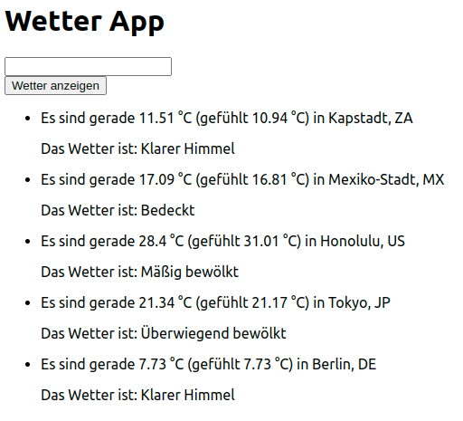

# Wetter-App mit React

Verwende die API [OpenWeather](https://openweathermap.org/current) und baue eine Webseite, mit der man das Wetter abfragen kann.

## Vorbereitung

- Falls du noch keinen API-Key hast, erstelle ein Account auf [OpenWeather](https://openweathermap.org). Du sollst deinen eigenen API-Key benutzen.
- Mache ein paar API-Abfragen in Thunder Client oder in einem anderen Tool. Teste unterschiedliche Abfragen und schaue dir die Antworten des Servers an.

## Aufgaben

- Auf der Webseite soll mindestens ein Input für eine Stadt und ein Button mit dem Text "Wetter anzeigen" vorhanden sein. Wenn ein Nutzer eine Stadt eingegeben hat und auf den Button klickt, soll auf der Seite ein Text mit dem Wetter erscheinen.
  
  Beispiel:

      Es sind gerade 7.73 °C (gefühlt 7.73 °C) in Berlin, DE  
      Das Wetter ist: Klarer Himmel

- Erweitere die Seite, so dass sie die Ergebnisse der letzten fünf Abfragen (in einer Liste) anzeigt. Wird eine neue Abfrage gemacht, wird die älteste Abfrage nicht mehr angezeigt.
- Die Seite soll die neueste Abfrage als erste anzeigen.
- Speichere die Ergebnisse der Abfragen in localStorage und zeige sie an, wenn die Seite neu geladen wird.
- Style die Seite so wie es dir gefällt!

Beispiel:

## Bonus

- Füge eine Option ein, womit der Nutzer eine Vorschau für die nächsten 5 Tage bekommen kann.
- Füge weiter Funktionalitäten hinzu, z.B.
  - weitere Wetter-Daten holen
  - eine passende Animation zu jedem Wetter auf der Seite anzeigen.

## Regeln

- Verwende **git** um die Zwischenstufen zu speichern.